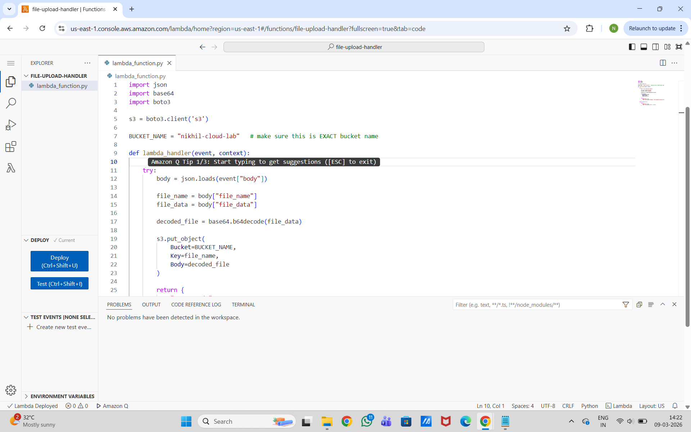
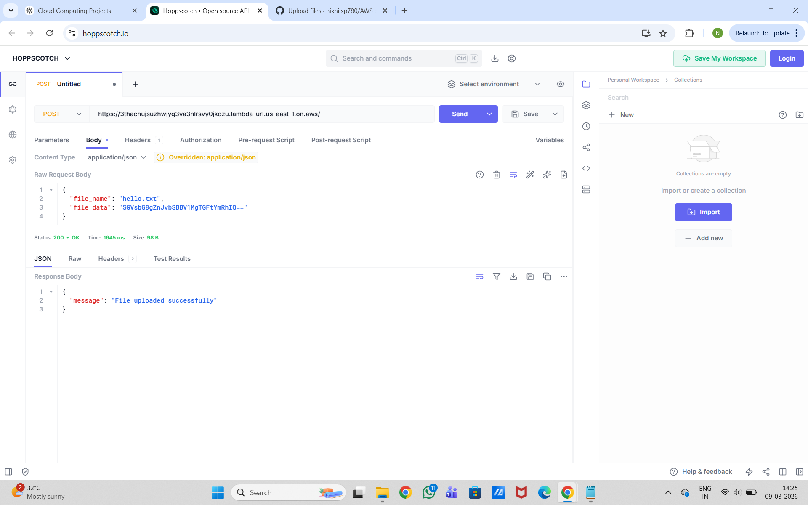
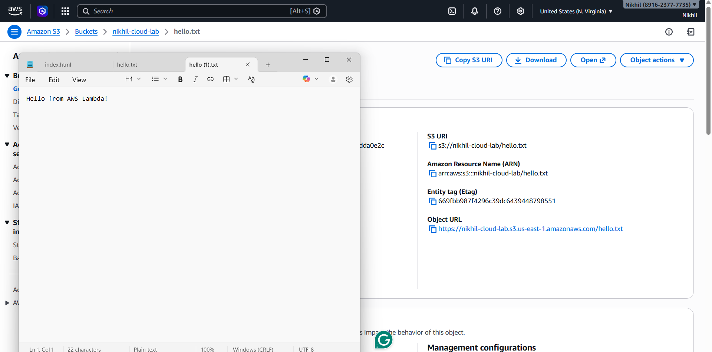

# AWS Serverless File Upload System

This project demonstrates a **serverless architecture** that uploads files to **Amazon S3 using AWS Lambda and Python**.

## Architecture

Client → Lambda Function URL → AWS Lambda → Amazon S3

## Technologies Used

* AWS Lambda
* Amazon S3
* Python
* Boto3
* REST API
* Serverless Architecture

## How it Works

1. Client sends a POST request with file name and base64 encoded data.
2. Lambda function receives the request.
3. Lambda decodes the file data.
4. File is uploaded to an Amazon S3 bucket.

## Example Request

```json
{
  "file_name": "hello.txt",
  "file_data": "SGVsbG8gZnJvbSBBV1MgTGFtYmRhIQ=="
}
```

## Response

```json
{
  "message": "File uploaded successfully"
}
```

## Author

Nikhil SP

## Project Demo

### Lambda Function Code



### API Request Success



### File Uploaded to Amazon S3



